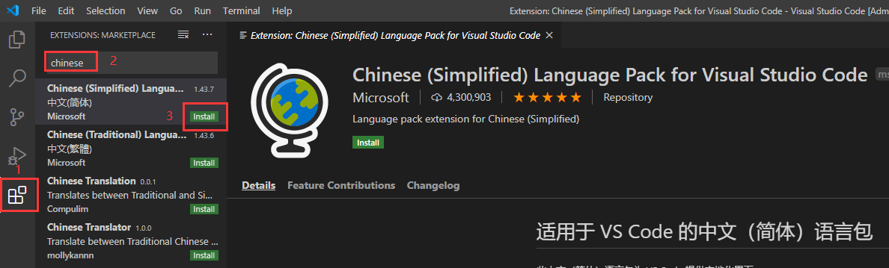
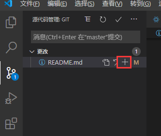
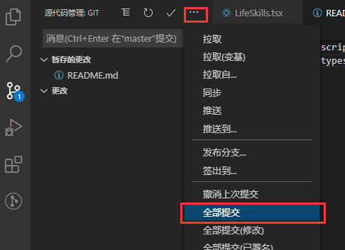
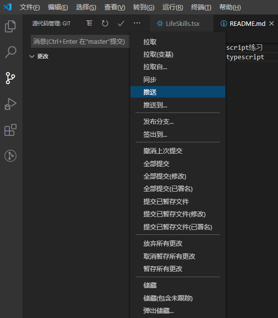

## 一、下载和安装
1.浏览器搜索vscode，进入官网下载安装包（注意user和system版本的区别）
2.点击安装包执行安装程序

## 二、下载插件
### 1.中文（简体）语言包
1.点击extensions->输入框输入chinese->点击Chinese (Simplified) Language Pack for Visual Studio Code右边的install->重启vscode  

### 2.Debugger for Chrome
在vscode中调试代码
### 3.GitLens
git日志查看插件
1）提交git(略过配置)  
  
  
 
### ESlint
代码检测工具  
### vetur
可以格式化html、标准css（有分号 、大括号的那种）、标准js（有分号 、双引号的那种）、vue文件
